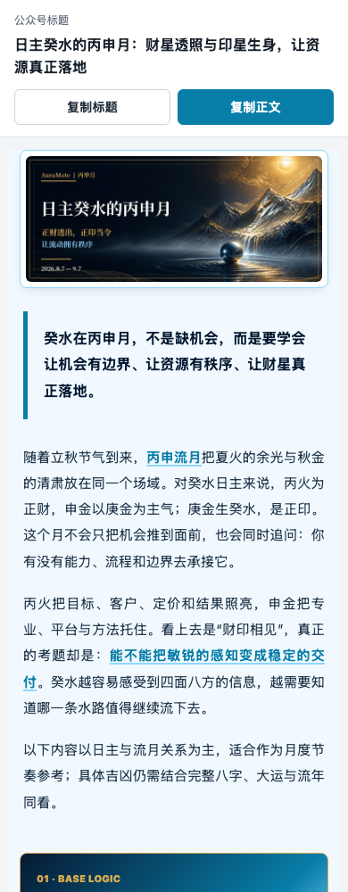
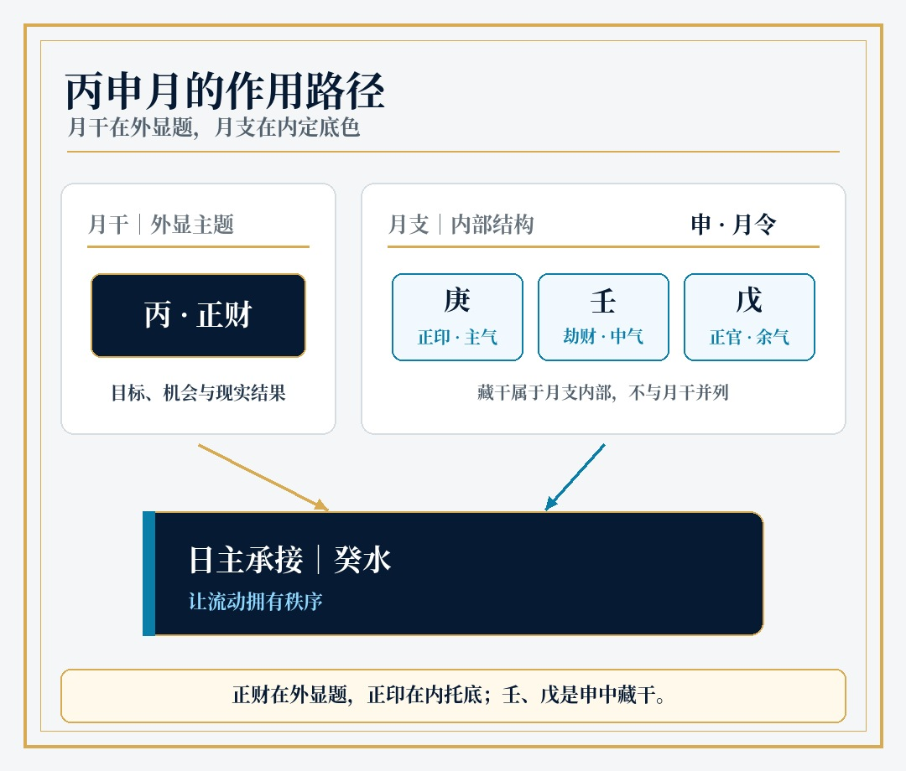
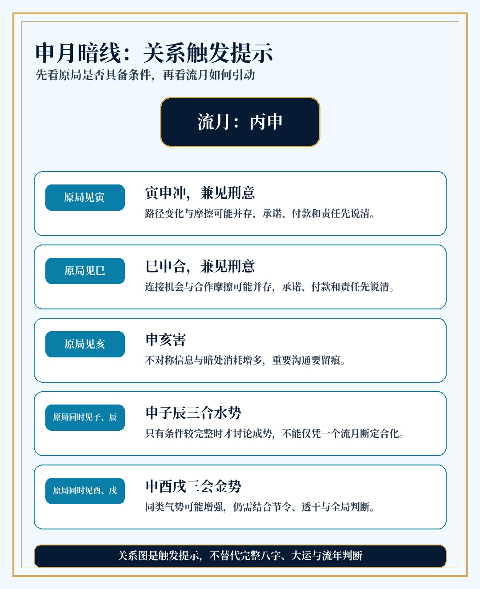
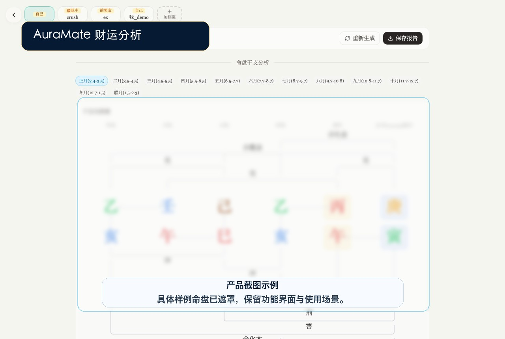
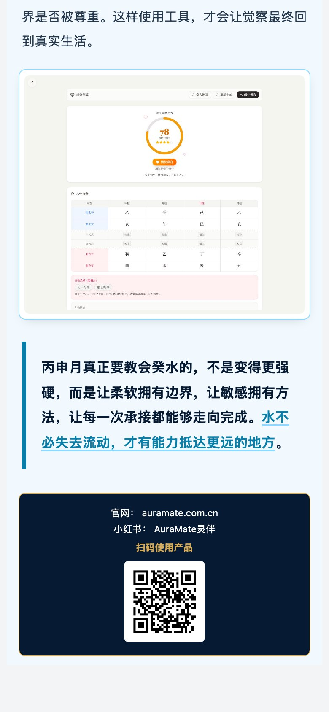

# AuraMate 灵伴公众号流月运势 Skill

为十天干日主生成可直接用于微信公众号的流月运势文章：从十神、藏干与地支关系计算开始，完成深度正文、五行主题配色、封面与信息图、AuraMate 产品截图章节，最终输出一个可分别复制“公众号标题”和“正文富文本”的一键粘贴预览页。

仓库的目标是让一个完全没有历史对话上下文的 agent，仅阅读 [SKILL.md](SKILL.md) 和按需引用的规范文件，也能稳定复现同等结构与质量。


## 最终交付

最终文件为 `work/article_预览.html`。页面顶部显示完整公众号标题，并提供两个彼此独立的操作：

- **复制标题**：复制纯文本标题，粘贴到公众号标题框。
- **复制正文**：复制带内联样式和图片的正文富文本，粘贴到公众号正文编辑器。

公众号标题固定使用 `日主{十大日主之一}的{流月干支}月：{主题句}`。十大日主固定为 `甲木、乙木、丙火、丁火、戊土、己土、庚金、辛金、壬水、癸水`，例如 `日主癸水的丙申月：财星透照与印星生身，让资源真正落地`。检查器和预览生成器都会依据 `context.json` 拒绝错误前缀。

流程到预览页结束，不自动登录、修改或保存微信公众号后台。



## 视觉效果

流月结构图采用紧凑版式，月干与月支并列解释，藏干明确收在月支内部。相比早期竖长图，画布从 `1080×1450` 缩短为 `1080×920`，以浅灰纸面、白色分区、深墨色文字和少量五行主色构成。



刑冲合害图只展示“原局具备什么条件时可能触发”，不会把单一流月关系写成确定事件。



AuraMate 产品章节使用官网真实、未打码截图，不另外叠加“示例截图”说明。截图用于展示功能界面，不把截图内的样例命盘当作文章命盘。



文章末尾先用浅色引语块收束观点，再以深色品牌卡展示官网、小红书和“扫码使用产品”。二维码本体固定为约 `90px`，不会在手机端随正文宽度放大。



## 能力范围

- 十天干日主与流月天干的十神计算。
- 十二地支藏干、主气／中气／余气解释。
- 六冲、六合、六害、三刑、三合与三会触发提示。
- 每个日主对应六个日柱的自动筛选与差异分析。
- 木、火、土、金、水五套主题色，保留 AuraMate 品牌金作为点缀。
- `1410×600`、2.35:1 的粗宋体单行封面。
- 紧凑能量结构图、关系图、六大日柱图。
- 3200–5000 字深度文章结构检查。
- 微信公众号 HTML 的 `<span leaf="">`、内联样式和禁用项校验。
- 标题与正文分开复制的一键粘贴预览页。
- 紧凑的深色品牌尾卡，含官网、小红书和手机端小尺寸二维码。

## 安装

把仓库直接克隆到 Codex skills 目录：

```bash
git clone git@github.com:ChenJiangxi/auramate-gzh-month.git \
  ~/.codex/skills/auramate-gzh-month
cd ~/.codex/skills/auramate-gzh-month
python3 -m pip install -r requirements.txt
```

然后对 agent 说：

```text
使用 $auramate-gzh-month 生成癸水日主的丙申月公众号文章，
完成配图和排版，最后给我一键粘贴预览页。
```

## 标准流程

1. 运行 `scripts/bazi_core.py`，生成唯一的 `context.json`。
2. 按 `references/editorial-standard.md` 写 3200–5000 字 Markdown。
3. 用图像生成模型制作无字封面背景，再运行 `scripts/render_month_assets.py` 叠字和画图。
4. 运行 `scripts/capture_auramate.py`，从登录后的 AuraMate 在线产品页实时截取财运分析、缘分测算；再运行 `scripts/check_capture.py --assets work/assets` 检查采集时间与来源。
5. 运行 `scripts/check_article.py work/article.md --context work/context.json` 检查结构与固定标题格式，再生成干净正文 HTML。
6. 运行 `scripts/validate_gzh_html.py`，修到 0 ERROR、0 WARNING。
7. 运行 `scripts/wrap_preview.py work/article.html --context work/context.json --title-file work/article.md`，再次校验标题并生成标题与正文可分别复制的预览页。

完整命令、文章章节顺序和质量门槛见 [SKILL.md](SKILL.md)。

## AuraMate 登录与截图

`scripts/capture_auramate.py` 支持登录 `auramate.com.cn`／`auramate.net` 并实时保存未打码产品截图。登录信息优先从当前环境变量读取：

```bash
export AURAMATE_EMAIL="你的账号"
read -s AURAMATE_PASSWORD
export AURAMATE_PASSWORD
python3 scripts/capture_auramate.py
unset AURAMATE_PASSWORD
```

也可以把本机账号写入 `scripts/auramate_credentials.local.json`，结构参考 `assets/templates/auramate_credentials.local.example.json`。该文件已被 Git 忽略，便于 agent 直接登录，同时避免明文密码进入公开提交历史。

每次截图会生成 `work/assets/auramate-capture.json`，记录实时采集时间和两个在线页面 URL。`scripts/check_capture.py` 默认拒绝超过 12 小时的截图，也拒绝复用示例图。

若财运产品路由随年份变化，可通过 `AURAMATE_FORTUNE_URL` 指定当年的页面地址。

## 示例与验证

`assets/examples/guishui-bingshen/` 包含癸水日主丙申月的文章、命理上下文、无字背景、封面、信息图、真实产品截图和最终公众号 HTML，可作为无上下文 agent 的黄金参考。

运行全部测试：

```bash
python3 -m unittest discover -s tests -v
```

当前回归覆盖十神计算、六大日柱、申月关系去重、五行色板、封面单行标题、紧凑结构图尺寸、公众号 HTML 合规和标题／正文复制区域隔离。

## 目录结构

```text
auramate-gzh-month/
├── SKILL.md
├── README.md
├── agents/openai.yaml
├── references/
│   ├── bazi-reference.md
│   ├── editorial-standard.md
│   ├── publishing.md
│   └── visual-system.md
├── scripts/
│   ├── bazi_core.py
│   ├── capture_auramate.py
│   ├── check_capture.py
│   ├── render_month_assets.py
│   ├── render_wechat_html.py
│   ├── title_rules.py
│   ├── validate_gzh_html.py
│   └── wrap_preview.py
├── assets/
│   ├── brand/
│   ├── examples/
│   ├── fonts/
│   ├── readme/
│   └── templates/
└── tests/
```

## 写作边界

文章以传统命理文化与自我觉察为定位，不替代完整八字、大运和流年判断，也不提供医学诊断、投资收益承诺或确定性的关系结论。正文固定保留如下提示：

> 以下内容以日主与流月关系为主，适合作为月度节奏参考；具体吉凶仍需结合完整八字、大运与流年同看。
