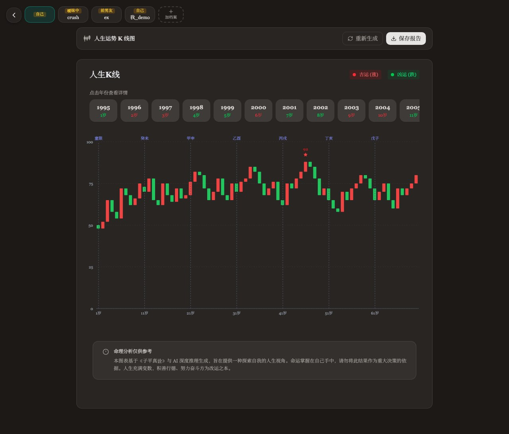
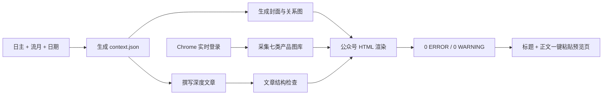

<p align="center">
  
</p>

<h1 align="center">AuraMate 灵伴公众号流月运势 Skill</h1>

<p align="center">
  从命理关系计算到微信公众号富文本预览的一体化内容工作流
</p>

<p align="center">
  <strong>命理计算 · 深度写作 · 五行视觉 · 实时产品截图 · 一键粘贴</strong>
</p>

<p align="center">
  <a href="#快速开始">快速开始</a> ·
  <a href="#创作自由与质量底线">创作边界</a> ·
  <a href="#完整工作流">完整流程</a> ·
  <a href="#质量验证">质量验证</a> ·
  <a href="#项目结构">项目结构</a>
</p>

---

## 这是什么

`auramate-gzh-month` 为十天干日主生成微信公众号流月运势文章。它以同一份命理上下文驱动正文、封面、关系图和六大日柱图，并从 AuraMate 官网实时采集产品截图，最后生成可分别复制标题与正文的预览页。

它不是一个只替换干支的固定模板。仓库约束命理事实、内容模块和微信兼容性，同时把开场、小标题、篇幅重心、现实案例、金句、产品组合与辅助配图留给 agent 根据当月主题创作。

| 输入 | 核心处理 | 最终输出 | 流程终点 |
|---|---|---|---|
| 日主、流月干支、年份、日期范围 | 十神／藏干／刑冲合害计算，长文写作，五行视觉，实时截图 | `article_预览.html`、干净正文 HTML、完整标题 | 一键粘贴预览页，不操作公众号后台 |

## 成品预览

### 手机端正文

预览页把标题和正文分成两个复制目标。正文使用公众号兼容的内联样式，主题色底框在手机端尽量铺开，同时保留稳定的阅读边距。

<p align="center">
  
</p>

### 结构图与关系图

结构图只负责说明月干、月支、藏干与日主之间的链路；关系图只说明原局具备相应地支时可能触发什么，不把流月关系写成确定事件。

<table>
  <tr>
    <td width="50%" align="center"></td>
    <td width="50%" align="center"></td>
  </tr>
  <tr>
    <td align="center"><sub>紧凑流月结构图</sub></td>
    <td align="center"><sub>条件式关系触发图</sub></td>
  </tr>
</table>

### AuraMate 真实产品界面

产品章节不使用仓库旧图代替当次截图。脚本登录 Chrome 后实时建立七类产品图库，正文再根据流月主题选择 3–4 类。

<table>
  <tr>
    <td width="50%" align="center"></td>
    <td width="50%" align="center"></td>
  </tr>
  <tr>
    <td align="center"><sub>财运分析</sub></td>
    <td align="center"><sub>人生 K 线</sub></td>
  </tr>
</table>

### 结尾品牌卡

文章以观点收束，而不是以功能介绍收尾。二维码卡固定写官网、小红书和“扫码使用产品”，二维码本体约 `90px`，不会在手机端随容器放大。

<p align="center">
  
</p>

## 快速开始

### 1. 安装

```bash
git clone git@github.com:ChenJiangxi/auramate-gzh-month.git \
  ~/.codex/skills/auramate-gzh-month
cd ~/.codex/skills/auramate-gzh-month
python3 -m pip install -r requirements.txt
```

### 2. 配置本机 AuraMate 测试账号

复制配置模板，并只在本机填写账号密码：

```bash
cp assets/templates/auramate_credentials.local.example.json \
  scripts/auramate_credentials.local.json
chmod 600 scripts/auramate_credentials.local.json
```

`scripts/auramate_credentials.local.json` 已写入 `.gitignore`，不得提交到仓库。也可以改用 `AURAMATE_EMAIL` 与 `AURAMATE_PASSWORD` 环境变量。

### 3. 发出任务

```text
使用 $auramate-gzh-month 生成癸水日主的丙申月公众号文章，
完成配图、AuraMate 实时产品截图和排版，
最后给我标题与一键粘贴预览页。
```

可补充参考文章、年份、日期范围、希望强调的现实主题或封面视觉方向。未指定创作细节时，agent 会依据当月命理矛盾自行决定。

## 标题规则

公众号标题必须采用：

```text
日主{天干}{五行}的{流月干支}月：{主题句}
```

其中日主只能从十大日主中选择：`甲木、乙木、丙火、丁火、戊土、己土、庚金、辛金、壬水、癸水`。

正确示例：

```text
日主癸水的丙申月：财星透照与印星生身，让资源真正落地
```

`context.json`、文章检查器和预览生成器会共同校验前缀，避免把“日主癸水”误写成“癸水日主”，也避免遗漏冒号后的主题句。

## 创作自由与质量底线

Skill 采用“稳定内容骨架 + 可变叙事表达”。固定项保证准确和可发布，自由项让不同日主、不同流月真正写出不同气质。

| 必须稳定 | 可以自由发挥 |
|---|---|
| 标题格式与十大日主名称 | 冒号后的主题句 |
| 加粗“提示：”及完整提示语 | 开场可用场景、问题、反差或判断 |
| 十神、藏干、地支关系与六大日柱事实 | 二级／三级标题的措辞与节奏 |
| 结构→强弱→关系→现实→日柱→产品的相对顺序 | 各模块篇幅可随主题浮动约 20%–30% |
| 四大现实维度都要覆盖 | 现实案例、关键词、金句与转场方式 |
| AuraMate 实时图库至少覆盖 5 类，正文选 3–4 类 | 选择哪些产品、以什么顺序承接论点 |
| 封面比例、微信 HTML 与移动端验证 | 辅助配图数量与视觉叙事 |

允许额外增加一个与当月高度相关的主题章节，也允许合并相邻短段。不能为了形式变化打乱逻辑顺序、虚构命理关系，或把产品截图中的样例数据当成本文命盘。

正文固定保留：

> **提示：** 以下内容以日主与流月关系为主，适合作为月度节奏参考；具体吉凶仍需结合完整八字、大运与流年同看。

## 完整工作流



### 1. 生成唯一命理上下文

```bash
python3 scripts/bazi_core.py \
  --day-master 癸 \
  --month-pillar 丙申 \
  --year 2026 \
  --date-range "2026.8.7 — 9.7" \
  --output work/context.json
```

正文、封面和全部信息图必须读取同一个 `context.json`，避免十神、藏干或地支关系在图文之间不一致。

### 2. 写作与结构检查

按 [文章编辑标准](references/editorial-standard.md) 完成 3200–5000 个中文字符，并运行：

```bash
python3 scripts/check_article.py work/article.md --context work/context.json
```

检查器按语义识别六个内容模块，不要求小标题出现固定词句，但会验证模块相对顺序、提示语、标题、核心配图和 3–4 个产品占位符。

### 3. 生成视觉资产

先使用图像生成模型生成无中文文字的封面背景，再由脚本使用粗宋体叠字并绘制信息图：

```bash
python3 scripts/render_month_assets.py \
  --context work/context.json \
  --background work/cover-background.png \
  --output-dir work/assets
```

封面固定为 `1410×600`，即 2.35:1；“日主××的××月”保持粗宋体单行。木、火、土、金、水分别使用不同主题色，AuraMate 品牌金只作为强调色。

### 4. 实时采集产品图库

```bash
python3 scripts/capture_auramate.py
python3 scripts/check_capture.py --assets work/assets
```

默认采集：

| 标识 | 产品 | 默认页面 | 适合承接的文章主题 |
|---|---|---|---|
| `fortune` | 财运分析 | `/play/fortune-2026` | 现金流、机会、交易与资源 |
| `kline` | 人生 K 线 | `/play/life-kline` | 长期周期、起伏与节奏 |
| `report` | 专业报告 | `/play/professional-report` | 命盘总览、综合判断 |
| `talent` | 天赋脑图 | `/play/brain-skills` | 能力结构、表达与职业选择 |
| `health` | 命理体检 | `/play/health-wuyun` | 体质、恢复与生活方式 |
| `match` | 缘分测算 | `/play/fate-match` | 关系、协作与边界 |
| `mbti` | MBTI 命格解析 | `/play/mbti-personality` | 人格模式、自我理解 |

截图不打码，不叠“示例截图”字样。采集清单写入 `work/assets/auramate-capture.json`，记录七类产品 URL、文件名与采集时间；默认拒绝超过 12 小时的截图。

### 5. 渲染公众号正文

```bash
python3 scripts/render_wechat_html.py \
  --context work/context.json \
  --article work/article.md \
  --assets work/assets \
  --qr assets/brand/auramate-wechat-qrcode.png \
  --output work/article.html

python3 scripts/validate_gzh_html.py work/article.html
```

渲染结果使用内联样式和公众号可接受的标签，并检查 `<span leaf="">`、禁止项、图片尺寸和尾卡结构。

### 6. 生成一键粘贴预览页

```bash
python3 scripts/wrap_preview.py work/article.html \
  --context work/context.json \
  --title-file work/article.md
```

最终打开 `work/article_预览.html`，分别测试“复制标题”和“复制正文”。预览工具栏不会混入正文复制区域。

## 产品截图凭据

脚本读取顺序：

1. `AURAMATE_EMAIL` 与 `AURAMATE_PASSWORD` 环境变量。
2. 被 Git 忽略的 `scripts/auramate_credentials.local.json`。
3. 若都不存在则停止并说明缺少凭据。

推荐的临时环境变量方式：

```bash
export AURAMATE_EMAIL="你的账号"
read -s AURAMATE_PASSWORD
export AURAMATE_PASSWORD
python3 scripts/capture_auramate.py
unset AURAMATE_PASSWORD
```

真实账号与密码不得进入 `README.md`、`SKILL.md`、测试、日志或 Git 历史。

## 质量验证

运行全部回归测试：

```bash
python3 -m unittest discover -s tests -v
```

发布前的最低标准：

- 十神、藏干、关系图和正文来自同一份上下文。
- 标题严格符合固定格式，提示语完整且“提示：”加粗。
- 正文 3200–5000 中文字符，核心结构完整，小标题不机械重复模板。
- 六大日柱逐柱有结构、风险与行动，不只写口号。
- 实时图库至少 5 类，正文选择 3–4 类且与主题有关。
- 封面为 2.35:1、粗宋体单行标题、无封面图注。
- 手机端无横向溢出，主题底框不过窄，信息图文字不碰撞。
- `validate_gzh_html.py` 输出 `0 ERROR`、`0 WARNING`。
- 结尾为观点引语 + 深色品牌卡 + 小尺寸二维码 + “扫码使用产品”。

## 输出文件

| 文件 | 用途 |
|---|---|
| `work/context.json` | 唯一命理事实来源 |
| `work/article.md` | 完整文章源稿 |
| `work/assets/` | 封面、信息图与实时产品截图 |
| `work/article.html` | 干净公众号正文 HTML |
| `work/article_预览.html` | 标题与正文可分别复制的最终交付页 |

## 项目结构

```text
auramate-gzh-month/
├── SKILL.md                         # agent 入口与完整执行规则
├── README.md                        # 项目介绍、效果与操作手册
├── agents/openai.yaml               # skill 元数据
├── references/
│   ├── bazi-reference.md            # 十神、藏干与地支关系参考
│   ├── editorial-standard.md        # 写作深度、自由度与内容骨架
│   ├── publishing.md                # 实时截图与预览交付规则
│   └── visual-system.md             # 五行色板与配图规范
├── scripts/
│   ├── bazi_core.py                 # 生成命理上下文
│   ├── check_article.py             # 标题、内容模块与占位符检查
│   ├── capture_auramate.py          # Chrome 登录与七类产品截图
│   ├── check_capture.py             # 截图来源、数量与新鲜度检查
│   ├── render_month_assets.py       # 封面及信息图绘制
│   ├── render_wechat_html.py        # Markdown 转公众号正文
│   ├── validate_gzh_html.py         # 微信 HTML 合规检查
│   └── wrap_preview.py              # 一键粘贴预览页
├── assets/
│   ├── brand/                       # 二维码与品牌资产
│   ├── examples/guishui-bingshen/   # 黄金示例
│   ├── fonts/                       # 封面字体
│   ├── readme/                      # README 效果图
│   └── templates/                   # 文章与本机配置模板
└── tests/                            # 命理、视觉与发布链路回归测试
```

## 能力边界

- 内容定位为传统命理文化与自我觉察，不替代完整八字、大运和流年判断。
- 不提供医学诊断、投资收益承诺或确定性的关系结论。
- 图片用于解释结构和展示产品，不替代正文推理。
- 流程停在一键粘贴预览页，不自动登录、修改、保存或发布微信公众号草稿。

更细的 agent 执行规则见 [SKILL.md](SKILL.md)，写作取舍见 [references/editorial-standard.md](references/editorial-standard.md)。
